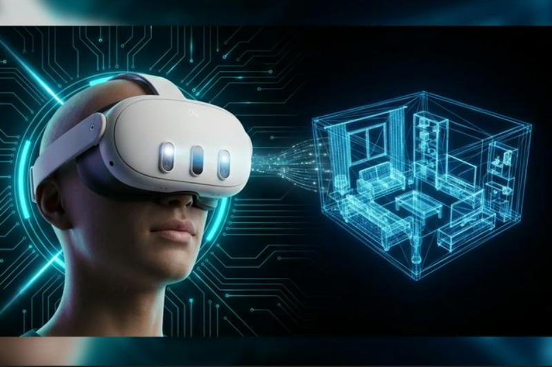

<p align="center">
  
</p>

# <p align="center">🥽 QuestGear 3D Studio</p>

<p align="center">
  <a href="https://www.python.org/downloads/"></a>
  <a href="https://opensource.org/licenses/MIT"></a>
  <a href="https://flet.dev/"></a>
  <a href="http://www.open3d.org/"></a>
</p>

**QuestGear 3D Studio** is a premium tool for high-quality 3D scene reconstruction directly from data captured via **Meta Quest 3** headsets (using **QuestGear 3D Scan** or legacy Quest Recording Manager). Using advanced volumetric integration (TSDF), QuestGear converts raw YUV/JPG images and depth maps into detailed, textured 3D models.

**Supports both:**
- ✅ **QuestGear 3D Scan** - Modern format (scan_data.json + transforms.json + JPG/PNG)
- ✅ **Quest Recording Manager** - Legacy format (hmd_poses.csv + YUV/RAW)

---

## ✨ Key Features

- 🚀 **GPU Acceleration**: Built on **Open3D Tensor API**, utilizing CUDA for 10x-50x faster reconstruction.
- ⚡ **Asynchronous Pipeline**: Fast data processing without freezing the interface.
- 🎨 **Modern Deep UI**: Elegant interface built using the **Flet** platform with dynamic progress bars.
- ⭐ **NerfStudio Integration**:
  - **Auto-Installer**: One-click setup of CUDA-accelerated environment.
  - **Monocular Depth**: [NEW] Neural depth estimation fallback (MiDaS) for color-only scans.
  - **Quality Presets**: Choose between **Fast** (preview), **Balanced**, and **Quality** modes.
  - **Batch Processing**: Queue up multiple scans to train overnight.
  - **Model History**: Browse and revisit all your past training runs.
  - **Multi-Format Export**: Save as PLY, OBJ, or GLB for use in Blender/Unity/Web.
- 🏢 **Scene Understanding**: Full support for Meta Quest Scene Model geometry and semantic labels.
- 🛠️ **Advanced Processing**:
  - **YUV_420_888 Conversion**: Automatic conversion of Quest raw formats to RGB.
  - **JPG/PNG Support**: Modern image formats with auto-detection.
  - **Depth Validation**: Smart detection of invalid/placeholder depth data
- 🌐 **Scalable VoxelBlockGrid**: Efficient sparse volume reconstruction for large scenes.
- 👓 **Stereo Reconstruction**: Utilize both Quest cameras for denser, more complete models.
- 🎬 **Smart Cropping & Live View**: Preview video before processing and watch real-time progress.
- 🧹 **Mesh Post-Processing**: Built-in smoothing and decimation tools for clean, optimized models.
- 💾 **Safe Storage**: Models are saved to a dedicated `Export` folder with persistent, timestamped naming.
- 🔍 **Robust Monitoring**: Accurate RAM usage tracking and high-quality reconstruction thumbnails.
- 🛑 **Full Control**: Native **Stop** buttons for both ZIP extraction and 3D reconstruction processes.
- 📐 **Customizable Layout**: Resizable panels to adjust the workspace to your preference.
- 🖼️ **Integrated 3D Viewer**: [NEW] High-performance **Three.js** viewer embedded directly in the UI for instant GLB inspection.
- 🎨 **Advanced Texturing**: [NEW] **UV Unwrapping (xatlas)** and **Projective Texture Baking** for sharp, professional-grade visual quality.
- 🛰️ **Drift Correction (SLAM)**: [NEW] **Generalized ICP** and **Pose Graph Optimization** to correct tracking drift and ensure global accuracy in large scenes.
- 🕳️ **AI Hole Filling**: [NEW] **MiDaS-based Depth Inpainting** to intelligently fill gaps on reflective or dark surfaces.
- 🗿 **Poisson Reconstruction**: [NEW] Generate **water-tight (solid)** 3D meshes, perfect for 3D printing and clean topology.
- 🚀 **Multi-Backend Acceleration**: [NEW] Support for **NVIDIA CUDA** and **AMD/Intel DirectML (ONNX)** for high-speed AI processing on any hardware.

---

## 🛠️ Technology Stack

| Component | Technology |
| :--- | :--- |
| **Language** | Python 3.11 |
| **Frontend** | Flet (Flutter-based) |
| **3D Engine** | Open3D |
| **Neural Rendering** | NerfStudio (Gaussian Splatting, NeRF) |
| **Computer Vision** | OpenCV & NumPy |
| **Data Format** | JSON / CSV / YAML |

---

## 🚀 Quick Start

### 📝 Prerequisites
- **OS**: Windows 10/11
- **Python**: 3.11 (Recommended)
- **Data**: Quest Capture data (ZIP or extracted folder)

### 💻 Installation
```powershell
# Clone the project
git clone https://github.com/blagojevicboban/QuestStream.git
cd QuestStream

# Environment setup
python -m venv venv
.\venv\Scripts\activate

# Install dependencies
pip install -r requirements.txt
pip install scipy
```

### 🎮 Running
```powershell
python main.py
```

---

## 📂 Project Structure

```text
QuestStream/
├── main.py            # Application entry point
├── config.yml         # Global reconstruction settings
├── modules/
│   ├── gui.py         # Flet UI and thread management
│   ├── reconstruction.py# TSDF Engine (Open3D)
│   ├── quest_adapter.py # Quest data adaptation
│   ├── quest_image_processor.py # YUV/Depth processing
│   ├── quest_reconstruction_utils.py # Poses/Depth Utils
│   ├── texture_processor.py # UV Unwrapping & Baking
│   ├── pose_refinement.py   # SLAM & Drift Correction
│   ├── monocular_depth.py   # AI Inpainting & ONNX Engine
│   └── config_manager.py# YAML Config loader
└── README_QUEST.md    # Detailed instructions for Quest 3 pipeline
```

---

## 🎓 Advanced Usage

For best results when recording with Meta Quest 3, we recommend:
1. **Frame Interval**: Use `1` in Settings for maximum detail.
2. **Voxel Size**: Set to `0.01` or `0.02` depending on processing power.
3. **Movement**: Move slowly and circle around objects for better data overlap.

A more detailed guide can be found in [README_QUEST.md](./README_QUEST.md).

---

## 📄 License

This project is licensed under the **MIT License** - see [LICENSE](LICENSE) for details.

---
*Developed with ❤️ for the Meta Quest Community*
